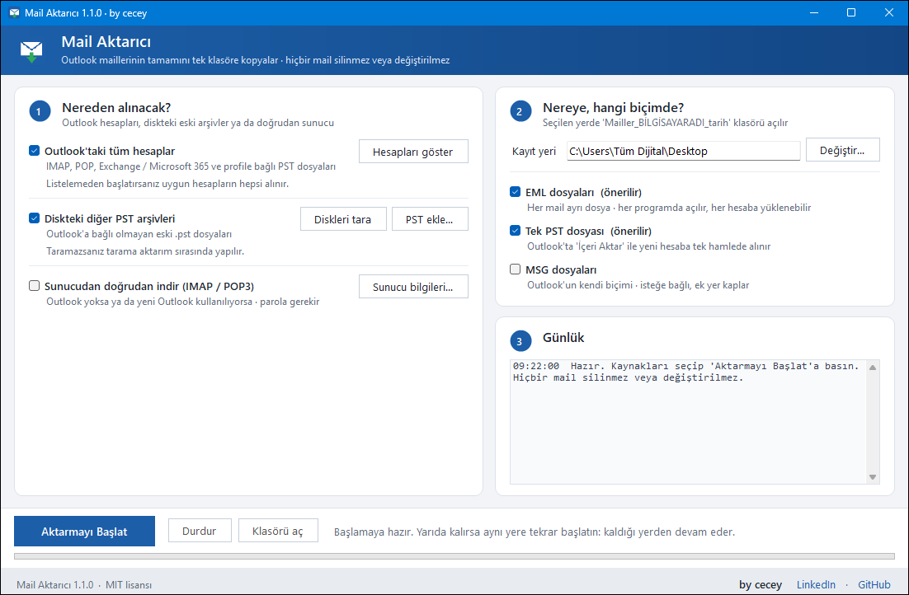

# Mail Aktarıcı

Outlook maillerinin tamamını tek klasöre EML ve PST olarak kopyalayan, kurulum gerektirmeyen Windows aracı.

| Sürüm | Platform | Lisans | İndirme |
|---|---|---|---|
| 1.1.0 | Windows 10 / 11, klasik Outlook | MIT | [Son sürüm](../../releases/latest) |

Bilgisayar değişiminde ya da yeni mail adresine geçişte kullanıcının bütün maillerini eksiksiz taşımak için geliştirildi. Kaynaktaki hiçbir mail silinmez veya değiştirilmez.



---

## Ne yapar?

- **Outlook'taki bütün hesapları** alır: IMAP, POP, Exchange / Microsoft 365 ve Outlook'a bağlı PST dosyaları.
- **Diskteki eski PST arşivlerini** bulur ve onları da aktarır (Outlook'a bağlı olmasalar bile).
- İsteğe bağlı: Outlook yoksa ya da yeni Outlook kullanılıyorsa mailleri **IMAP / POP3 ile doğrudan sunucudan** indirir.
- Çıktıyı iki biçimde birden üretir:
  - **EML**: her mail ayrı dosya, Outlook'taki klasör yapısıyla. Her mail programında açılır, her tür hesaba yüklenebilir.
  - **PST**: hepsi tek dosyada (`TumMailler.pst`). Outlook'ta *İçeri Aktar* ile yeni hesaba tek hamlede alınır.
- Ekler, gömülü resimler, mailin içindeki mail, okundu/işaretli bilgisi ve tarihler korunur.
- Bitince **sayıları doğrular**: her klasör için "kaynakta kaç mail vardı, kaç tanesi alındı" raporu yazar.

## Kullanım

1. `MailAktarici.exe` dosyasını mailleri alınacak bilgisayara götürün ve çift tıklayın.
2. **Aktarmayı Başlat**'a basın. Varsayılan kayıt yeri Masaüstü.
3. Masaüstünde `Mailler_BİLGİSAYARADI_tarih` klasörü oluşur. Klasörü olduğu gibi flash belleğe kopyalayın.

> Windows "tanınmayan uygulama" uyarısı verirse: **Ek bilgi → Yine de çalıştır**. Program imzasız olduğu için bu uyarı normal.

### Klasörde neler var?

```
Mailler_BILGISAYAR_2026-10-02_1530\
├─ info@ornek.com\           her hesap ayrı klasör, içinde Outlook'taki klasörler ve .eml dosyaları
├─ PST - eski_arsiv\         diskte bulunan PST dosyaları
├─ TumMailler.pst            hepsi tek dosyada (40 GB üstünde hesap başına ayrı PST)
├─ mail_listesi.csv          Excel'de açılan tam liste
├─ ozet_rapor.txt            hesap hesap, klasör klasör sayım ve doğrulama
└─ gunluk.txt                ayrıntılı kayıt
```

### Yeni adrese aktarma

- **Outlook ile:** yeni hesabı Outlook'a ekleyin → *Dosya → Aç ve Dışarı Aktar → İçeri/Dışarı Aktar → Başka bir program veya dosyadan içeri aktar → Outlook Veri Dosyası (.pst)* → `TumMailler.pst` → "Öğeleri şu klasöre aktar" kısmında yeni hesabı seçin.
- **EML ile:** dosyalar her mail programında açılır; Thunderbird'e klasör klasör sürüklenebilir. Her hesap klasöründeki `_liste.tsv` tarih, okundu bilgisi ve klasör rolünü (gelen, gönderilen, taslak...) tutar.

## Yarıda kalırsa

- Disk çıkarılır, dolar ya da durdurursanız program kapanmaz; sebebini yazıp durur.
- Aynı yere tekrar başlatınca **kaldığı yerden devam eder**; sağlam yazılmış mailleri yeniden yazmaz.
- Yer yetmeyecekse aktarım başlamadan sorar.
- Beklenmeyen bir hata olursa sebebi Masaüstüne `MailAktarici_HATA_tarih.txt` olarak yazılır. Günlüğün bir kopyası her zaman bilgisayarın kendi diskinde durur: `%LOCALAPPDATA%\MailAktarici`.
- Outlook açılırken bir soru sorarsa (güvenli mod, profil seçimi, dosya onarımı) program soruyu öne getirir ve cevabı bekler.

## Sınırlar

- Outlook ve PST kısmı için bilgisayarda **klasik (masaüstü) Outlook** kurulu olmalı. Yeni Outlook dışarıdan okunamıyor; o durumda sunucudan indirme seçeneği kullanılır.
- Microsoft 365 / Outlook.com artık parola ile IMAP girişine izin vermiyor. Bu hesaplar klasik Outlook üzerinden alınır.
- Exchange hesaplarında Outlook bazen yalnız son 1 yılı bilgisayarda tutar. Rapor bunu fark edip uyarır.
- Gmail'de aynı mail birden çok etikette durduğu için birden çok klasörde görünebilir.

## Güvenlik ve gizlilik

- Program yalnız okur: Outlook'ta ve sunucuda hiçbir şeyi silmez, taşımaz, işaretini değiştirmez (IMAP'te `EXAMINE` ve `BODY.PEEK`, POP3'te `DELE` yok).
- Parola hiçbir yere kaydedilmez, yalnız o çalışma boyunca bellekte durur.
- İnternete yalnız "sunucudan doğrudan indir" seçilirse, o sunucuya bağlanır. Başka hiçbir yere veri gönderilmez.

## Kaynaktan derleme

Hiçbir şey kurmak gerekmez; Windows'un içindeki .NET Framework derleyicisi kullanılır.

```bat
build.bat            :: dist\MailAktarici.exe
build.bat konsol     :: ayrıca tests\bin\MailAktarici-konsol.exe (komut satırı sürümü)
```

### Komut satırı

```bat
MailAktarici.exe listele
MailAktarici.exe disa-aktar --hedef D:\Yedek --pst-tara
MailAktarici.exe disa-aktar --devam D:\Yedek\Mailler_PC_2026-10-02_1530
MailAktarici.exe disa-aktar --outlook-yok --sunucu imap.ornek.com --kullanici ali@ornek.com --parola ...
MailAktarici.exe yardim
```

### Testler

- `tests\eml_dogrula.py <Mailler_... klasörü>`: üretilen her `.eml` dosyasını Python'un bağımsız MIME ayrıştırıcısıyla denetler.
- `tests\test_pst_olustur.ps1 -Dizin <klasör>`: zor durumlar içeren bir test PST'si üretir (uzun Türkçe ek adları, gömülü resim, mail içinde mail, yasak karakterli konu).

## Proje yapısı

| Dosya | Görev |
|---|---|
| `src/OutlookExport.cs` | Outlook hesaplarını ve PST'leri gezer, EML/MSG/PST üretir |
| `src/Mime.cs` | EML (MIME) yazıcı, başlık kodlama |
| `src/Net.cs`, `src/ServerExport.cs` | IMAP / POP3 istemcisi ve sunucudan indirme |
| `src/Package.cs` | Çıktı klasörü, liste, rapor, kaldığı yerden devam |
| `src/MainForm.cs`, `src/Ui.cs`, `src/ServerDialog.cs` | Arayüz |
| `src/Jobs.cs`, `src/Program.cs` | İş akışı ve komut satırı |

## Lisans

[MIT](LICENSE) · **by cecey** · [LinkedIn](https://www.linkedin.com/in/cuma-ali-dirik/) · [GitHub](https://github.com/ceceys)

---

### English summary

**Mail Aktarıcı** ("Mail Exporter") is a portable Windows tool that copies every email from a computer's classic Outlook (IMAP, POP, Exchange / Microsoft 365, attached and stray PST files) into one folder, as `.eml` files plus a single `.pst`, so the mailbox can be moved to a new address on another machine. It is read-only, needs no installation (built with the .NET Framework compiler that ships with Windows), verifies counts per folder, resumes interrupted exports, and can also download directly from IMAP/POP3 servers. MIT licensed.
